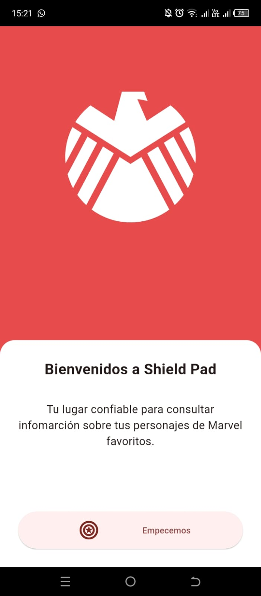
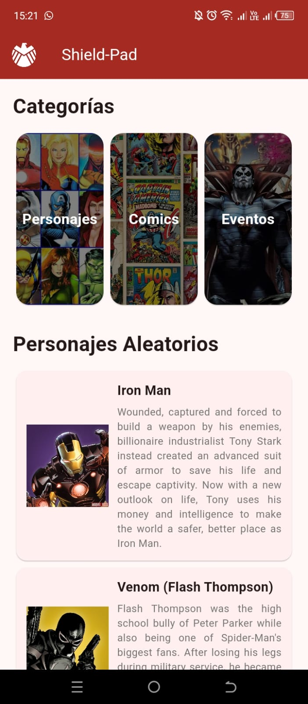
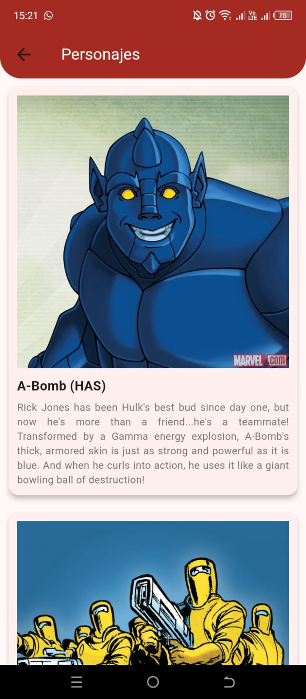
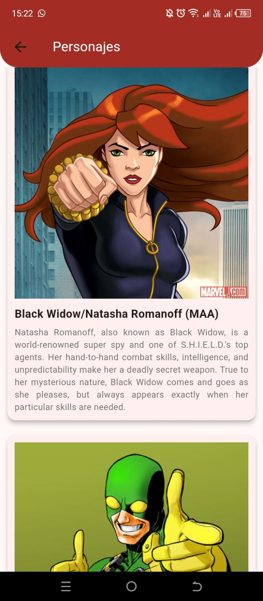

<h1 align="center">Shield Pad</h1>

Una aplciación que te permite conocer información escencial sobre tus personajes favoritos de Marvel Comics. Esta aplciación esta desarrollada para Android, con el SDK de Flutter y empleando el API RESTful de Marvel Developer Team.

## Empezando con el proyecto
Antes de empezar con el proyecto, debes tener los siguientes componentes instalados:

- Flutter 3.22 (con Dart 3.4.3).
- Visual Studio Code (con las extensiones de Flutter y Dart).
- Android Studio (desde la versión Iguana 2023.2.1 en adelante).

Te recomiendo que si eres desarrollador de Flutter, utilices Flutter version Management (FVM) para gestionar las versiones de tu SDK. Pudes obtener esta herramienta desde la [web oficial de FVM](https://fvm.app/).

## Configuración y lanzamiento de APK
1. Para poder acceder al siguiente proyecto, debes utilizar el comando <code>git clone https://github.com/bryandelgado99/Shield-App.git</code>

2. Una vez clonado el repositorio, en la Terminal de tu preferencia, debes correr el comando <code>flutter pub get</code> para descargar las dependencias del proyecto.

3. Para este proyecto puedes utilizar Visual Studio Code o Android Studio. Dentro de la terminal de uno de estos IDE's ejecuta el comando <code>flutter run</code>.

>[!Important]  
>Es necesario contar con un dispositivo Android para la depuración del proyecto. Puedes crear un dispositivo virtual, en Android Studio, con **Android Virtual Device** o conectar tu dispositivo en modo depuración. 

4. Para el lanzamiento del APK, es necesario configurar un archivo de firma digital. Puedes guiarte a través de la documentación de [Flutter Docs](https://docs.flutter.dev/deployment/android).

## Capturas de funcionamiento
### Vista de bienvenida
  

### Pantalal de inicio
  

### Personajes
  
  

## Descarga la aplicación
Obten la aplicación de Shield Pad, en su versión más reciente, desde el siguiente enlace:

| Versión de la aplicación  | Versión de Android Min.                  | Enlace de descarga                                                                             |
|---------------------------|------------------------------------------|------------------------------------------------------------------------------------------------|
| 
1.0.0
    | 
Android 5.0 (Lollipop)
  |
[Descargar](https://github.com/bryandelgado99/Shield-App/releases/tag/1.0.1)
   |
